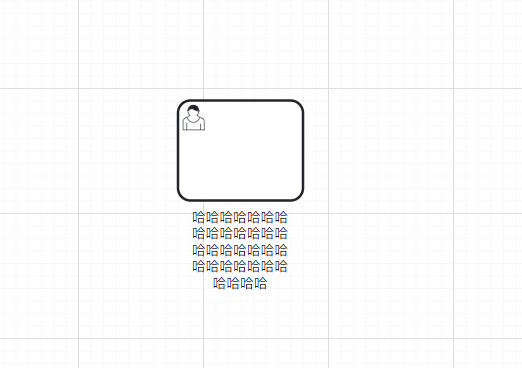

# bpmn-js-external-label-modeling

A bpmn-js plugin used to render Label tags outside of nodes.

一个用来将Label标签渲染在节点外部的bpmn-js插件。

## How to use 如何使用

1. ~~Clone this repository.~~
2. ~~Copy the `ExternalLabel` directory to your own project.~~
3. ~~`import` it.~~


1. ~~克隆这个项目.~~
2. ~~将 `ExternalLabel` 这个目录复制到你自己的项目中.~~
3. ~~使用 `import` 导入这个模块.~~


>  This project has been published as an NPM dependency package.
>
> 该项目已经发布为一个NPM依赖包

1. Add the bpmn-js-external-label-modeling to your project:

```sh
npm install bpmn-js-external-label-modeling
```

2. Add it to the additionalModules Array

```js
import Modeler from 'bpmn-js/lib/Modeler'
import ExternalLabelModule from 'bpmn-js-external-label-modeling'

const modeler = new Modeler({
  container: '#container',
  additionalModules: [
    // ...
    ExternalLabelModule
  ]
})
```

## Preview 效果预览


